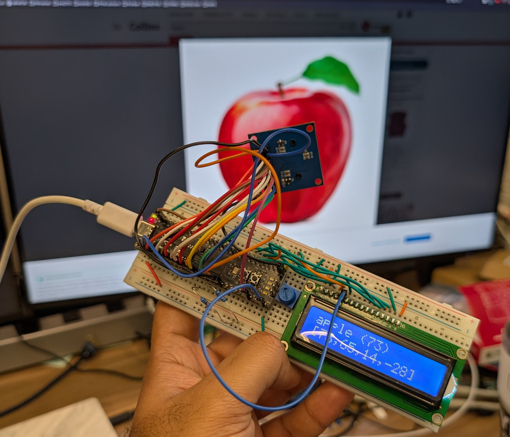
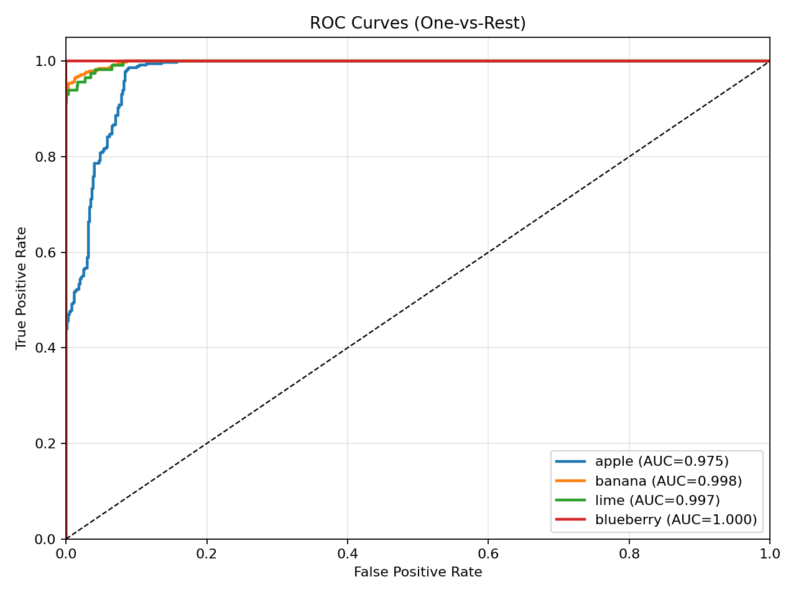

# OV7670 Camera UVC Driver and Fruit Classifier on RP2350

> [!WARNING]
> This documentation was generated by an AI language model (Claude Opus 4.6) based on the provided codebase (which was *also* AI-generated!). It may contain inaccuracies or omissions. Please verify all technical details against the source code and hardware specifications before relying on this information for development or troubleshooting.
> 
> In some ways, this is really an exercise in demonstrating how well AI can assist in creating an entire project with technical documentation (even though there is a chance that some of it might be bogus...).

## What is this?

This project turns a small, inexpensive camera module (the OV7670) into a USB webcam that works on Windows, macOS, and Linux - no special drivers or software needed. When you plug the device into your computer, it shows up as a regular camera, just like any other webcam you might buy. You can open it with any camera app (such as Zoom, OBS, Google Meet, or the built-in Camera app on your OS) and see a live video feed.

In addition to the camera, the device also provides a serial port over the same USB cable. This serial port prints diagnostic information and real-time results from a built-in fruit classifier - a small machine learning model running directly on the device that can identify apples, bananas, limes, and blueberries in the camera's view.

The firmware also drives a 2x16 HD44780-compatible character LCD (sometimes written as "HD77480" in notes) to show startup status and live classification results directly on the device.

The single USB cable carries both the video feed and the serial port simultaneously, so there is nothing extra to connect.



## How does it work?

The system has five main components:

1. [**OV7670 camera module**](https://www.digikey.com/en/products/detail/olimex-ltd/CAMERA-OV7670/21662189) - A small image sensor that captures video at 160×120 pixels in YUV color format. It outputs pixel data through 8 parallel data lines, synchronized by clock and framing signals.

2. **RP2350 microcontroller (on the ["Proton" board](https://ece362-purdue.github.io/proton-labs/))** - An dual-core ARM Cortex-M33 microcontroller from Raspberry PI that reads pixel data from the camera, stores it in memory, and sends it to the computer over USB. Its second core is dedicated to running the fruit classifier model.

3. **TinyUSB software stack** - Firmware running on the microcontroller that implements the USB Video Class (UVC) protocol, making the device appear as a standard webcam to any computer.

4. **Fruit classifier model** - A quantized INT8 convolutional neural network trained on the Fruits-360 dataset and deployed directly onto the RP2350's flash memory. It runs on the microcontroller's second core, classifying each frame as apple, banana, lime, or blueberry. The model was trained in Python using TensorFlow/Keras, quantized to INT8 for efficient inference on the Cortex-M33 with CMSIS-NN acceleration, and exported as a C array that is compiled into the firmware. See the [Fruit Classifier](#fruit-classifier) section for details on how the model was designed, trained, and deployed.

5. [**HD44780 LCD module**](https://www.adafruit.com/product/181) - A parallel 2-line text display used for local status. It shows boot progress messages, classifier startup state, and live class/confidence output so you can monitor the system without opening a serial terminal.

The data flow works as follows:

- The camera continuously captures frames. Each frame starts with a VSYNC (vertical sync) pulse, which triggers the microcontroller to begin recording pixel data.
- A hardware state machine (PIO) on the microcontroller reads 8 bits of pixel data on every pixel clock edge, while the HREF (horizontal reference) signal is active. This runs independently of the CPU - no software is needed to read individual pixels.
- A DMA (Direct Memory Access) channel automatically moves the pixel data from the PIO hardware into a frame buffer in RAM, again without CPU involvement.
- Once a complete frame arrives (signaled by the next VSYNC), the firmware swaps to a second frame buffer (double-buffering) so the camera can keep capturing while the previous frame is sent to the computer.
- The USB stack packages the frame data into UVC bulk transfer packets and sends them to the host computer, where the operating system's built-in UVC driver receives them and makes the video available to applications.
- Meanwhile, every 500 ms, the firmware sends the latest frame to the second CPU core, where the fruit classifier model runs inference. The on-device preprocessing converts the YUV422 camera data to 100×100 RGB, quantizes it to INT8, and feeds it through a 4-layer CNN - all without any network connection or cloud service. The classification result (e.g., "apple", confidence score) is printed over the serial port.
- In parallel, the LCD is updated with human-readable status: startup banners, camera/classifier readiness, and periodic inference output (class and score line, then raw score vector line).

## How to Set It Up

This section summarizes the exact wiring from the OV7670 camera and HD44780 LCD to the Proton board.

### OV7670 Camera to Proton

Use 3.3 V power and 3.3 V logic for the camera.  Add 10k pullups on the I2C pins SCL and SDA.

| OV7670 Signal | Proton GPIO | Notes |
|---|---:|---|
| D0 | 0 | Pixel data bit 0 |
| D1 | 1 | Pixel data bit 1 |
| D2 | 2 | Pixel data bit 2 |
| D3 | 3 | Pixel data bit 3 |
| D4 | 4 | Pixel data bit 4 |
| D5 | 5 | Pixel data bit 5 |
| D6 | 6 | Pixel data bit 6 |
| D7 | 7 | Pixel data bit 7 |
| PLK | 8 | Pixel clock |
| HS | 9 | Horizontal reference |
| VS | 10 | Vertical sync |
| SDA / SIOD | 12 | I2C data |
| SCL / SIOC | 13 | I2C clock |
| RESET | 14 | Active-low reset |
| PWDN | 15 | Power-down control |
| XLK | 23 | Camera master clock from Proton |
| 3V3 | Any 3V3 pin | Camera power |
| GND | Any GND pin | Common ground |

### HD44780 LCD to Proton (4-bit mode)

| LCD Pin/Signal | Proton GPIO | Notes |
|---|---:|---|
| RS | 31 | Register select |
| RW | 24 | Read/write (firmware drives low for writes) |
| E (EN) | 25 | Enable strobe |
| D4 | 27 | Data bit 4 |
| D5 | 28 | Data bit 5 |
| D6 | 29 | Data bit 6 |
| D7 | 30 | Data bit 7 |
| VSS | GND | Ground |
| VDD | 5V | Power pin |
| VO | GND | Contrast pin |
| A (LED+) | 5V | Typically to supply through resistor (module-dependent) |
| K (LED-) | GND | Ground |

### Bring-Up Checklist

1. Connect all grounds first (Proton, OV7670, LCD).
2. Wire OV7670 data/sync/control pins exactly as in the table above.
3. Confirm XCLK is connected to GPIO 23.
4. Wire the LCD in 4-bit mode (only D4-D7 are used).
5. Adjust LCD contrast on VO until text is visible.
6. Flash firmware and verify LCD startup messages appear.

## USB Video Class (UVC) and Serial Port (USB CDC)

### UVC - USB Video Class

UVC is a standard USB protocol that defines how video cameras communicate with computers. When a device follows this protocol, the computer already has a built-in driver for it - no installation required. This is the same protocol used by commercial webcams from Logitech, Microsoft, and others.

In this project, the firmware implements UVC 1.5 using the TinyUSB library's video device class. The device advertises itself as an uncompressed YUY2 video source at 160×120 pixels, 10 frames per second, using bulk transfers. When a camera application opens the device, it negotiates streaming parameters with the firmware through UVC Probe and Commit control requests. The firmware then begins transferring frame data - each 38,400-byte frame (160 × 120 × 2 bytes per pixel) is split into USB bulk packets and reassembled by the host driver.

Key UVC components in the firmware:
- **Video Control Interface** - Describes the camera's capabilities (input terminal, output terminal).
- **Video Streaming Interface** - Describes the video format (YUY2), resolution (160×120), and frame rate (10 fps). Contains the bulk endpoint used for transferring pixel data.
- **Probe/Commit negotiation** - The host queries what formats and frame rates the device supports, then commits to a specific configuration before streaming begins.
- **Payload headers** - Each USB packet includes a small header with a frame ID bit (toggled per frame) and an end-of-frame flag, allowing the host to reconstruct complete frames from the stream of packets.

### CDC - Communications Device Class

CDC is a standard USB protocol for serial communication. It makes the device appear as a virtual serial port (COM port on Windows, `/dev/ttyACMx` on Linux, `/dev/cu.usbmodemXXXX` on macOS).

In this project, CDC is used for debug output. The firmware prints status information over this serial port, including:
- VSYNC and frame counters
- USB streaming status
- Machine learning inference results (class name, confidence scores, inference time)

You can view this output with any serial terminal program (e.g., PuTTY, `screen`, `minicom`, or the PlatformIO serial monitor) at 115200 baud.

### Composite Device

The device uses a USB composite device configuration with Interface Association Descriptors (IAD) to present both UVC and CDC interfaces over a single USB connection. The host operating system sees two separate devices - a camera and a serial port - from one physical USB plug. The four interfaces are:

| Interface | Class | Purpose |
|-----------|-------|---------|
| 0 | CDC Control | Serial port control |
| 1 | CDC Data | Serial port data |
| 2 | Video Control | Camera control |
| 3 | Video Streaming | Camera video data |

## OV7670 Camera

### Overview

The OV7670 is a low-cost CMOS image sensor manufactured by OmniVision. It is widely used in hobbyist and educational projects due to its low price and simple parallel interface.

### Specifications

| Parameter | Value |
|-----------|-------|
| Sensor type | 1/6" CMOS |
| Resolution (native) | 640×480 (VGA) |
| Resolution (this project) | 160×120 (QQVGA) |
| Output format | YUV422 (YUY2) |
| Pixel clock | ~12.5 MHz (derived from XCLK) |
| Interface | 8-bit parallel data + sync signals |
| Configuration | I2C/SCCB at address 0x21 |
| Supply voltage | 3.3V |

### Output Format

The camera outputs pixels in [YUV 4:2:2 format](https://en.wikipedia.org/wiki/Chroma_subsampling) (specifically YUY2 byte order). Each pair of pixels shares chrominance (U, V color) values but has individual luminance (Y brightness) values. The byte sequence is: Y0, U, Y1, V - representing two pixels in 4 bytes. This format is directly compatible with what UVC expects for uncompressed streaming.

### Pin Connections

| Signal | GPIO | Description |
|--------|------|-------------|
| D0–D7 | 0–7 | 8-bit parallel pixel data |
| PCLK | 8 | Pixel clock - data valid on rising edge |
| HREF | 9 | Horizontal reference - high during active pixels |
| VSYNC | 10 | Vertical sync - pulses between frames |
| SDA | 12 | I2C data for register configuration |
| SCL | 13 | I2C clock for register configuration |
| RESET | 14 | Active-low reset |
| PWDN | 15 | Power-down control (active high) |
| XCLK | 23 | Master clock input (~12.5 MHz from MCU) |

### Configuration

The camera is configured over I2C using the SCCB (Serial Camera Control Bus) protocol, which is a simplified variant of I2C. At startup, the firmware:

1. Powers on the camera (PWDN low, RESET released)
2. Provides a ~12.5 MHz clock on XCLK
3. Verifies the camera's product ID register (expect 0x76)
4. Performs a software reset
5. Configures the internal phase-locked loop (PLL) for appropriate pixel clock timing
6. Sets YUV422 output mode
7. Writes initialization registers for color processing, white balance, and gamma
8. Configures QQVGA downsampling (160×120) from the native VGA sensor

### Frame Timing

The camera produces frames continuously. Each frame begins with a VSYNC falling edge (start of active video) and ends with a VSYNC rising edge. Within each frame, HREF goes high for each active line (120 lines), and PCLK toggles for each byte of pixel data (320 bytes per line = 160 pixels × 2 bytes per pixel).

## RP2350 Microcontroller and Proton

### RP2350

The RP2350 is a microcontroller designed by Raspberry Pi Ltd. It is the successor to the RP2040 (used in the Raspberry Pi Pico) and offers significant improvements.

| Parameter | Value |
|-----------|-------|
| CPU cores | 2× Arm Cortex-M33 |
| Clock speed | 150 MHz (default), 250 MHz (overclocked in this project) |
| SRAM | 520 KB |
| Flash | External, 16 MB on Proton board |
| USB | USB 1.1 Full Speed (12 Mbps) device |
| PIO | 2× Programmable I/O blocks, 4 state machines each |
| DMA | 16 channels |
| GPIO | 48 pins |

### Proton Board

The Proton is a custom development board built around the RP2350B chip. It exposes the necessary GPIO pins for connecting the OV7670 camera and provides USB connectivity. The PlatformIO build system is configured with a custom platform definition for this board.

### How the RP2350 Captures Video

The RP2350 uses three hardware subsystems working together to capture camera data with zero CPU overhead during pixel transfer:

1. **PIO (Programmable I/O)** - A small state machine programmed to read 8 bits of pixel data from GPIO 0–7 on each rising edge of PCLK, but only while HREF is high. It automatically packs 4 bytes (2 pixels) into a 32-bit word and pushes it to a FIFO. The PIO program is just 5 instructions:
   - Wait for HREF high (active video line)
   - Wait for PCLK rising edge
   - Read 8 data bits
   - Wait for PCLK falling edge
   - If HREF still high, loop; otherwise wait for next line

2. **DMA (Direct Memory Access)** - A DMA channel continuously drains the PIO's output FIFO and writes the 32-bit words sequentially into a frame buffer in RAM. The DMA is configured for 9,600 transfers (38,400 bytes ÷ 4 bytes per transfer) per frame. This runs entirely in hardware - the CPU does not touch pixel data at all.

3. **VSYNC interrupt** - A GPIO interrupt on the VSYNC pin signals the start and end of each frame. On VSYNC falling edge, the DMA is restarted to begin capturing a new frame. On VSYNC rising edge, the completed frame buffer is marked as ready, and the DMA switches to the alternate buffer (double-buffering).

### Dual-Core Usage

The RP2350's two Cortex-M33 cores are used for different tasks:

- **Core 0** handles all I/O: camera initialization, USB stack processing (`tud_task()`), UVC frame transfers, CDC serial output, and dispatching frames to Core 1.
- **Core 1** runs the TensorFlow Lite Micro inference engine. Every 500 ms, Core 0 signals Core 1 with a pointer to the latest frame buffer. Core 1 preprocesses the YUV data to RGB, downsamples to 100×100 pixels, quantizes to INT8, and runs the neural network. The result is passed back to Core 0 through shared variables.

### HD44780 LCD Output (runtime behavior)

The firmware initializes the HD44780 in 4-bit mode and writes 16-character lines. Based on `main.c`, these messages are shown:

- Boot banner:
   - Line 1: `Hi! I'm Proton!`
   - Line 2: `I identify fruit`
- After camera init:
   - Line 1: `My camera is`
   - Line 2: `initialized!`
- After ML core startup:
   - Line 1: `Fruit classifier`
   - Line 2: `has started!`
- During live inference updates (about every 300 ms when new result is ready):
   - Line 1 format: `<class_name> (<confidence>)` (example: `banana (52)`)
   - Line 2 format: `[s0,s1,s2,s3]` (raw INT8 scores for apple, banana, lime, blueberry)

The LCD interface in `hd44780.c` uses these GPIO pins on RP2350B:
- `RW=24`, `EN=25`, `RS=31`, `DB4=27`, `DB5=28`, `DB6=29`, `DB7=30`

### Overclocking

The system clock is set to 250 MHz (up from the default 150 MHz) by raising the core voltage to 1.20V and reconfiguring the system PLL. This reduces ML inference time and improves USB throughput.

### Memory Layout

RAM and flash should be accounted separately. The model blob (`fruit_model_data`) is linked into flash and does not consume SRAM like the tensor arena does.

| SRAM Region | Size | Usage |
|--------|------|-------|
| Frame buffers | 76,800 bytes | 2× 38,400-byte YUY2 frame buffers for double-buffering |
| TF Lite arena | 327,680 bytes | Tensor allocation for the ML model (100×100 input model) |
| `resized_image` buffer | 30,000 bytes | 100×100×3 INT8 preprocessed input scratch buffer |
| Stack + other | ~25 KB | USB buffers, globals, and stacks for both cores |
| **Total SRAM (estimated)** | **~459 KB / 520 KB** | **~88.3% utilization** |

| Flash Region | Size | Usage |
|--------|------|-------|
| Model weights (`fruit_model_data`) | ~106 KB | Quantized INT8 neural network stored in flash |

## Software Components

### Firmware (C/C++, runs on RP2350)

The firmware is built with PlatformIO using the Pico SDK framework. It consists of the following source files:

| File | Purpose |
|------|---------|
| `src/main.c` | Main application: camera init, DMA/PIO setup, VSYNC handler, UVC streaming loop, Core 1 ML dispatch, debug output |
| `src/usb_descriptors.c` | USB device, configuration, and string descriptors for the composite CDC+UVC device |
| `src/camera_capture.pio` | PIO state machine program for 8-bit parallel pixel capture |
| `src/hd44780.c` | HD44780 LCD driver (4-bit parallel mode, 2x16 text output) |
| `src/fruit_classifier.cpp` | TensorFlow Lite Micro wrapper: model loading, YUV-to-RGB preprocessing, inference, and result extraction |
| `include/usb_descriptors.h` | Frame dimensions, frame rate, interface numbers, endpoint addresses |
| `include/tusb_config.h` | TinyUSB configuration: enabled classes (UVC + CDC), buffer sizes, bulk streaming mode |
| `include/ov7670_regs.h` | OV7670 register addresses and initialization tables |
| `include/fruit_classifier.h` | Fruit classifier API (init, run, get timing) |
| `include/fruit_model.h` | Auto-generated C header containing the quantized INT8 TFLite model weights (106 KB) |

#### Build and Flash

```bash
# Build
source ~/.platformio/penv/bin/activate
pio run

# Flash (hold BOOTSEL button, then plug in USB)
cp .pio/build/proton/firmware.uf2 /media/$USER/RP2350/
```

#### Main Loop

The main loop on Core 0 runs three tasks in a tight loop with no need for an RTOS:

```
while (1) {
    tud_task();          // Process USB events (both UVC and CDC)
    video_send_frame();  // Send next frame if streaming and ready
    tud_task();          // Process USB events again (keeps USB responsive)
    // ... ML dispatch, debug output (throttled)
}
```

### Python Camera Viewer (`camera-test.py`, runs on host computer)

> [!NOTE]
> This script is intended for Linux users. On Windows and macOS, you can simply open the camera in any standard application (e.g., Zoom, Photo Booth) without needing this script.  
> 
> When we tried this with Ubuntu's default camera viewer, it crashed, hence the need for this script.  The spec followed by the default camera viewer may not be fully compatible with the UVC stream from this device, so we use OpenCV's `VideoCapture` to handle it instead.

A Python script is provided for viewing the camera feed on Linux. It uses OpenCV to capture frames from the V4L2 device and display them in a window scaled up 4× for easier viewing.

Features:
- **Auto-detection** - Finds the correct `/dev/videoX` device by matching the USB vendor/product ID (0xCAFE:0x4007) through sysfs
- **Hot-plug support** - Monitors for device connect/disconnect events and automatically reopens the stream
- **4× upscaling** - The 160×120 image is enlarged to 640×480 using cubic interpolation for display

Dependencies: `opencv-python`, `pyusb`

Usage:
```bash
python camera-test.py
# Press 'q' in the video window to quit
```

### Alternative Viewing Methods

Since the device is a standard UVC camera, it *should* work with any video application:

```bash
# ffplay (FFmpeg)
ffplay -f v4l2 -input_format yuyv422 -video_size 160x120 -i /dev/video0

# VLC
vlc v4l2:///dev/video0

# v4l2-ctl (command-line frame grab)
v4l2-ctl -d /dev/video0 --stream-mmap --stream-count=100 --stream-to=output.raw
```

On macOS and Windows, the device appears in the system camera list and works with FaceTime, Photo Booth, the Windows Camera app, Zoom, Google Meet, and other standard applications.

### Machine Learning Model

See the [Fruit Classifier](#fruit-classifier) section below for full details on the model architecture, training pipeline, and deployment strategy.

## Fruit Classifier

The fruit classifier is an on-device machine learning model that identifies objects in the camera's view in real time, entirely on the microcontroller with no internet connection. It classifies each frame into one of four categories: **apple**, **banana**, **lime**, or **blueberry**.

Ctrl-Click on each image to see the full size image in a new browser tab when you're giving it a try!

<a href="https://raw.githubusercontent.com/norandomtechie/proton-fruit-classifier/main/apple.png"></a>  

<a href="https://raw.githubusercontent.com/norandomtechie/proton-fruit-classifier/main/banana.png"></a>  

<a href="https://raw.githubusercontent.com/norandomtechie/proton-fruit-classifier/main/lime.png"></a>  

<a href="https://raw.githubusercontent.com/norandomtechie/proton-fruit-classifier/main/blueberry.png"></a>  


### Why On-Device ML?

Running classification directly on the RP2350 means the device is self-contained. There is no need for a server, cloud API, or even a computer - the microcontroller captures a frame, preprocesses it, runs the neural network, and reports the result, all within about 200 ms. This makes the system suitable for embedded applications where connectivity is unavailable or latency is critical.

### Model Architecture

The model is a small convolutional neural network (CNN) designed to fit within the RP2350's 520 KB of SRAM while still achieving high accuracy on the target classes.

| Parameter | Value |
|-----------|-------|
| Input | 100×100×3 RGB, INT8 quantized |
| Output | 4 classes (apple, banana, lime, blueberry) |
| Total parameters | 95,276 |
| Model size | 106 KB (INT8 quantized) |
| Inference time | ~200 ms at 250 MHz |
| Tensor arena | 320 KB |

The architecture has four convolutional blocks followed by a single dense classification layer:

```
Input (100×100×3)
  → Conv2D(24, 3×3) + BatchNorm + ReLU → MaxPool(2×2)    → 32×32×24
  → Conv2D(48, 3×3) + BatchNorm + ReLU → MaxPool(2×2)    → 16×16×48
  → Conv2D(64, 3×3) + BatchNorm + ReLU → MaxPool(2×2)    → 8×8×64
  → Conv2D(96, 3×3) + BatchNorm + ReLU → GlobalAvgPool    → 96
  → Dense(4)  [logits, no softmax]
```

Key design decisions:
- **No softmax output layer.** The model outputs raw logits. Softmax is omitted because it compresses the dynamic range of INT8 outputs and hurts quantized accuracy. The firmware simply picks the class with the highest logit.
- **BatchNormalization after each Conv2D.** This stabilizes training and gets folded into the convolution weights during quantization, so it adds zero runtime cost.
- **GlobalAveragePooling instead of Flatten.** This dramatically reduces parameter count (no large Dense layer after the conv blocks) and makes the model more robust to spatial position of the object.
- **Increasing filter counts (24 → 48 → 64 → 96).** Starts small to keep early layers fast, increases capacity in deeper layers where the spatial dimensions are smaller.

### Training Pipeline (`train_fruit_model.py`)

The training script handles the full workflow from dataset download to C header export.

#### 1. Dataset: Fruits-360

The model is trained on the [Fruits-360](https://www.kaggle.com/datasets/moltean/fruits) dataset (v87), which contains 100×100 pixel images of various fruits on white backgrounds. The script downloads it automatically via `kagglehub`.

The script maps Fruits-360 folder names to four fruit classes by prefix matching (apple, banana, lime, blueberry). For apples, only red-apple variants are included in training.

#### 2. Class Balancing

Fruits-360 has very uneven class sizes (e.g., ~4,900 apple images vs. ~323 banana images). To prevent the model from being biased toward the overrepresented class, the script:
- Caps each fruit class at **2,000 images** maximum (random subsampling)
- Applies **sklearn class weights** during training so that underrepresented classes contribute more to the loss

#### 3. Class Availability Validation

The script validates that all configured classes (apple, banana, lime, blueberry) were found in the selected Fruits-360 split before training proceeds. If any class has zero samples, training aborts with a clear error.

#### 4. Domain-Gap Augmentation

The Fruits-360 images look very different from what the OV7670 camera produces. Fruits-360 images are sharp, well-lit, and on white backgrounds. The OV7670 produces noisy, low-resolution, inconsistently-lit images with arbitrary backgrounds. To bridge this domain gap, aggressive data augmentation is applied during training:

- **Background replacement** - Detects near-white pixels (the Fruits-360 white backdrop) and replaces them with random colors and noise. This prevents the model from learning "white background = fruit."
- **Random scale and position** - Pads the image with random amounts and resizes back, simulating fruit at different distances and positions in the frame.
- **Color jitter** - Random brightness (±40%), contrast (0.5×–1.5×), saturation (0.5×–1.5×), and hue (±8%) adjustments to handle the OV7670's variable color output.
- **Geometric transforms** - Random 90° rotations, horizontal and vertical flips.
- **Gaussian noise** (σ=0.06) - Simulates the OV7670 sensor noise.

#### 5. Training

The model is trained for 50 epochs with:
- **Adam optimizer** (initial learning rate 1e-3)
- **ReduceLROnPlateau** - Learning rate halves if validation loss stalls for 3 epochs (minimum 1e-5)
- **SparseCategoricalCrossentropy with from_logits=True** - Matches the no-softmax output design
- **Class weights** - Computed via sklearn to compensate for class imbalance
- **80/20 train/validation split** - Shuffled before splitting

Validation accuracy depends on the exact train/validation split and random seed.

#### 6. INT8 Quantization

After training, the model is converted to a fully INT8-quantized TensorFlow Lite model using TFLite's post-training quantization:

- A representative dataset (200 training samples) is used to calibrate quantization ranges
- Both inputs and outputs are INT8 (not just weights) - this enables CMSIS-NN accelerated kernels on the Cortex-M33
- The `TFLITE_BUILTINS_INT8` op set is enforced, ensuring every operation runs in integer arithmetic

The quantized model is about 106 KB, stored in flash and run with a 320 KB tensor arena on-device.

#### 7. C Header Export

The quantized `.tflite` model is converted to a C header file (`include/fruit_model.h`) containing:
- The model weights as a `const unsigned char[]` array (aligned to 16 bytes for CMSIS-NN)
- Model metadata (`FRUIT_MODEL_INPUT_SIZE`, `FRUIT_NUM_CLASSES`, class name strings)
- Size constant for the firmware to reference

This header is compiled directly into the firmware - no filesystem or file loading needed on the microcontroller.

### On-Device Inference (`fruit_classifier.cpp`)

The firmware-side inference wrapper handles the pipeline from raw camera data to classification result:

1. **YUV-to-RGB conversion** - The 160×120 YUY2 frame from the camera is downsampled to 100×100 and converted to RGB using BT.601 color matrix math. Each pixel is independently converted:
   - Extract Y, U, V values from the interleaved YUY2 stream
   - Apply the standard YUV→RGB conversion: R = 1.164(Y-16) + 1.596(V-128), etc.
   - Clamp to [0, 255]

2. **INT8 quantization** - Each RGB value is quantized using the scale and zero-point parameters read from the TFLite model's input tensor at init time. This ensures the firmware's quantization exactly matches what the model was trained with.

3. **TF Lite Micro inference** - The quantized image is copied into the input tensor, and `interpreter->Invoke()` runs the model. The `MicroMutableOpResolver` registers only the 7 operators the model actually uses (Conv2D, MaxPool2D, FullyConnected, Reshape, Quantize, Dequantize, Mean), minimizing code size.

4. **Result extraction** - The output tensor's 4 INT8 values are compared; the index with the highest value determines the class. The result struct includes the class name, confidence score, and all 4 raw scores for debugging.

### Class Selection Notes

The current model targets **apple (red varieties only), banana, lime, and blueberry**. This matches the training script's class mapping and the generated model metadata used by firmware at runtime.

## ROC and AUC Analysis

The training script now computes one-vs-rest ROC curves on the validation split and writes both:

- `training/roc_curves.png` (plot image)
- `training/roc_auc_metrics.json` (per-class AUC values)

This runs automatically at the end of `training/train_fruit_model.py`.

### Results

- **ROC Curves**: Generated for each class (apple, banana, lime, blueberry).
- **AUC Scores**: Read from `training/roc_auc_metrics.json` after training.



To refresh the figure and metrics, rerun the training script.
